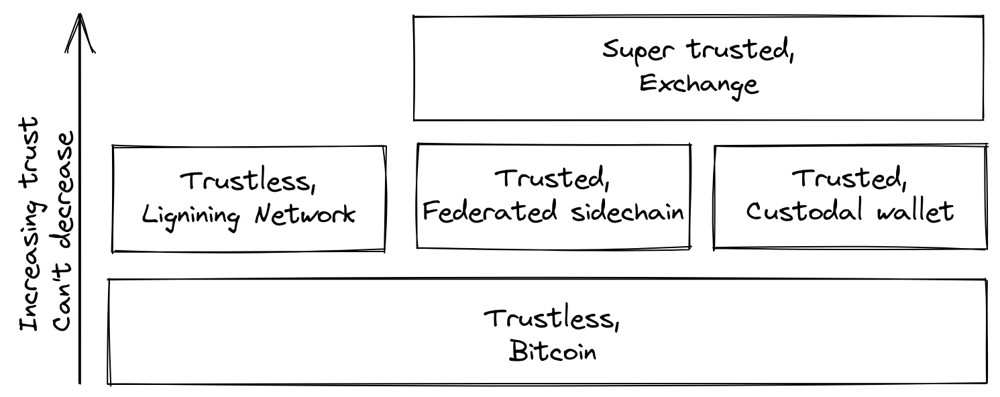

== Trustlessness

image::trustlessness-banner.jpg[]

This chapter dissects the concept of trustlessness, what it means from a computer
science perspective, and why Bitcoin has to be trustless to retain its
value proposition. We then talk about what it means to use Bitcoin in
a trustless way, and what kind of guarantees a full node can and cannot
give you. In the last section, we look at the real-world interaction
between Bitcoin and actual softwares or users, and the need to make
trade-offs between convenience and trustlessness to get anything done
at all.

[qrcode,role=qrcode]
----
https://strfsh.xyz/bdp/13dc7180
----

People often say things like "`Bitcoin is great because it's
trustless`". What do they mean by trustless? Pieter Wuille explains
this widely used term on
https://bitcoin.stackexchange.com/a/45674/69518[Stack Exchange]:

[quote, Pieter Wuille, Bitcoin Stack Exchange (2016)]
____
The trust we're talking about in "trustless" is an abstract technical
term. A distributed system is called trustless when it does not
require any trusted parties to function correctly.
____

In short, the word _trustless_ refers to a property of the Bitcoin
protocol whereby it can logically function without "`any trusted
parties`". This is different from the trust you inevitably have to
put into the software or hardware you run. More on this latter aspect of trust will be discussed further
in this chapter.

[qrcode,role=qrcode]
----
https://strfsh.xyz/bdp/0e46aca4
----

In centralized systems, we rely on a central actor's reputation in order to make sure
that they will take care of security or roll back in case of issues,
as well as on the legal system to sanction any violations. These trust
requirements are problematic in pseudonymous decentralized systems - there is
no possibility of recourse so there really can't be any trust. In the introduction to
https://bitcoin.org/bitcoin.pdf[the Bitcoin whitepaper], Satoshi Nakamoto
describes this problem:

[quote,Satoshi Nakamoto, Bitcoin: A Peer-to-Peer Electronic Cash System (2008)]
____
Commerce on the Internet has come to rely almost exclusively on
financial institutions serving as trusted third parties to process
electronic payments. While the system works well enough for most
transactions, it still suffers from the inherent weaknesses of the
trust based model.  Completely non-reversible transactions are not
really possible, since financial institutions cannot avoid mediating
disputes. The cost of mediation increases transaction costs, limiting
the minimum practical transaction size and cutting off the possibility
for small casual transactions, and there is a broader cost in the loss
of ability to make non-reversible payments for nonreversible
services. With the possibility of reversal, the need for trust
spreads. Merchants must be wary of their customers, hassling them for
more information than they would otherwise need.  A certain percentage
of fraud is accepted as unavoidable. These costs and payment
uncertainties can be avoided in person by using physical currency, but
no mechanism exists to make payments over a communications channel
without a trusted party
____

It seems that we can't have a decentralized system based on trust, and
that's why trustlessness is important in Bitcoin.

To use Bitcoin in a trustless manner, you have to run a
fully-validating Bitcoin node. Only then will you be able to verify
that the blocks you receive from others are following the consensus
rules; for example, that the coin issuance schedule is kept and that no
double-spends occur on the blockchain. If you don't run a full node,
you outsource verification of Bitcoin blocks to someone else and
trust them to tell you the truth, which means you're not using Bitcoin
trustlessly.

[qrcode,role=qrcode]
----
https://strfsh.xyz/bdp/84ac2026
----

David Harding has authored
https://bitcoin.org/en/bitcoin-core/features/validation[an article on
the bitcoin.org website] explaining how running a full node - or
using Bitcoin trustlessly - actually helps you.

[quote, David Harding, Full Validation on bitcoin.org (2015)]
____
The bitcoin currency only works when people accept bitcoins in
exchange for other valuable things. That means it’s the people
accepting bitcoins who give it value and who get to decide how Bitcoin
should work.

When you accept bitcoins, you have the power to enforce Bitcoin’s
rules, such as preventing confiscation of any person’s bitcoins
without access to that person’s private keys.

Unfortunately, *many users outsource their enforcement power*. This
leaves Bitcoin’s decentralization in a weakened state where a handful
of miners can collude with a handful of banks and free services to
change Bitcoin’s rules for all those non-verifying users who
outsourced their power.

Unlike other wallets, *Bitcoin Core does enforce the rules*—so if the
miners and banks change the rules for their non-verifying users, those
users will be unable to pay full validation Bitcoin Core users
like you.
____

He says that running a full node will help you verify every aspect of
the blockchain without trusting anyone else, so as to ensure that the coins you
receive from others are genuine. This is great, but there's one important
thing that a full node can't help you with: it can't prevent double-
spending through chain rewrites:

[quote, David Harding, Full Validation on bitcoin.org (2015)]
____
Note that although all programs—including Bitcoin Core—are vulnerable
to chain rewrites, Bitcoin provides a defense mechanism: the more
confirmations your transactions have, the safer you are. There is no
known decentralized defense better than that.
____

No matter how advanced your software is, you still have to trust that
the blocks containing your coins won't be rewritten. However, as pointed
out by Harding, you can await a number of confirmations, after which
you consider the probability of a chain rewrite small enough to be
acceptable.

The incentives for using Bitcoin in a trustless way align with the
system's need for <<fullnodedecentralization,full node
decentralization>>. The more people who use their own full nodes, the
more full node decentralization, and thus the stronger Bitcoin stands
against malicious changes to the protocol. But unfortunately, as
explained in the full node decentralization section, users often opt
for trusted services as consequence of the inevitable trade-off between trustlessness and convenience.

[qrcode,role=qrcode]
----
https://strfsh.xyz/bdp/94c925be
----

Bitcoin's trustlessness is absolutely imperative from a system
perspective. In 2018, Matt Corallo,
https://btctranscripts.com/baltic-honeybadger/2018/trustlessness-scalability-and-directions-in-security-models/[spoke
about trustlessness] at the Baltic Honeybadger conference in Riga.
// Video: https://youtu.be/66ZoGUAnY9s?t=4019
The essence of that talk is that you can't build trustless systems on
top of a trusted system, but you can build trusted systems - for
example, a custodial wallet - on top of a trustless system.

.A trustless base layer allows for various trade-offs on higher levels.

This security model allows the system designer to select trade-offs
that make sense to them without forcing those trade-offs on others.

[[donttrustverify]]
=== Don't trust, verify

Bitcoin works trustlessly, but you still have to trust your software and
hardware to some degree. That's because your software or hardware
might not be programmed to do what's stated on the box. For example:

* The CPU might be maliciously designed to detect private key
  cryptographic operations and leak the private key data.
* The operating system's random number generator might not be as
  random as it claims.
* Bitcoin Core might have sneaked in code that will send your private
  keys to some bad actor.

[qrcode,role=qrcode]
----
https://strfsh.xyz/bdp/fdbbf04a
----

So, besides running a full node, you also need to make sure you're
running what you intend to. Reddit user brianddk
https://www.reddit.com/r/Bitcoin/comments/smj1ep/bitcoin_v220_and_guix_stronger_defense_against/[wrote
an article] about the various levels of trust you can choose from, when
verifying your software. In the section "`Trusting the builders`", he
talks about _reproducible builds_:

[quote, brianddk on Reddit, Bitcoin v22.0 and Guix; Stronger defense against the "Trusting Trust Attack" (2022)]
____
Reproducible builds are a way to design software so that many
community developers can each build the software and ensure that the
final installer built is identical to what other developers
produce. With a very public, reproducible project like bitcoin, no
single developer needs to be completely trusted. Many developers can
all perform the build and attest that they produced the same file as
the one the original builder digitally signed.
____

The article defines 5 levels of trust: trusting the site, the
builders, the compiler, the kernel, and the hardware.

[qrcode,role=qrcode]
----
https://strfsh.xyz/bdp/f01c448b
----

To further deepen the topic of reproducible builds, Carl Dong
https://btctranscripts.com/breaking-bitcoin/2019/bitcoin-build-system/[made
a presentation about Guix]
explaining why
trusting the operating system, libraries, and compilers can be
problematic, and how to fix that with a system called Guix, which is
used by Bitcoin Core today.

[quote, Carl Dong on Guix, Breaking Bitcoin Conference (2019)]
____
So what can we do about the fact that our toolchain can have a bunch
of trusted binaries that can be reproducibly malicious? We need to be
more than reproducible. We need to be bootstrappable. We cannot have
that many binary tools that we need to download and trust from
external servers controlled by other organizations. We should know how
these tools are built and exactly how we can go through the process of
building them again, preferably from a much smaller set of trusted
binaries. We need to minimize our trusted set of binaries as much as
possible, and have an easily auditable path from those toolchains to
what we use how to build bitcoin. This allows us to maximize
verification and minimize trust.
____

He then explains how Guix allows us to only trust a minimal binary of
357 bytes that can be verified and fully understood if you know how
to interpret the instructions. This is quite remarkable: one verifies that
the 357-byte binary does what it should, then uses it to build the
full build system from source code, and ends up with a Bitcoin Core
binary that should be an exact copy of anyone else's build.

There's a mantra that many bitcoiners subscribe to, which captures well
much of the above:

[quote, Bitcoiners everywhere]
____
Don't trust, verify.
____

//noqr
This alludes to the phrase
"https://en.wikipedia.org/wiki/Trust,_but_verify[trust, but verify]"
that former U.S. president Ronald Reagan used in the context of
nuclear
disarmament. https://twitter.com/Truthcoin/status/1491415722123153408?s=20&t=ZyROxZxlBppdRpuuzsiF5w[Bitcoiners
switched it around to highlight the rejection of trust and the
importance of running a full node].

It's up to the users to decide to what degree they want to verify the
software they use and the blockchain data they receive. As with so
many other things in Bitcoin, there's a trade-off between convenience
and trustlessness. It's almost always more convenient to use a
custodial wallet compared to running Bitcoin Core on your own
hardware. However, as Bitcoin software is maturing and user interfaces are
improving, over time it should get better at supporting users willing to work
towards trustlessness. Also, as users gain more knowledge over time,
they should be able to gradually remove trust from the equation.

[qrcode,role=qrcode]
----
https://strfsh.xyz/bdp/4efc7cb4
----

Some users think adversarially (see <<adversarialthinking>>) and verify
most aspects of the software they run. As a consequence, they reduce the need for trust to the bare minimum,
as they only need to trust their computer hardware and operating system. In
doing so, they also help people who don't verify their hardware as thoroughly by
raising their voices in public to warn about any issues they might find. One
good example of this is an
https://bitcoincore.org/en/2018/09/20/notice/[event that occurred in
2018], when someone discovered a bug that would allow miners to spend an
output twice in the same transaction:

[quote, CVE-2018-17144 Full Disclosure on bitcoincore.org (2018)]
____
CVE-2018-17144, a fix for which was released on September 18th in
Bitcoin Core versions 0.16.3 and 0.17.0rc4, includes both a Denial of
Service component and a critical inflation vulnerability. It was
originally reported to several developers working on Bitcoin Core, as
well as projects supporting other cryptocurrencies, including ABC and
Unlimited on September 17th as a Denial of Service bug only, however
we quickly determined that the issue was also an inflation
vulnerability with the same root cause and fix.
____

Here, an anonymous person reported an issue that turned out much worse
than the reporter realized. This highlights the fact that people who verify the
code often report security flaws instead of exploiting them. This is
beneficial to those who aren't able to verify everything
themselves. However, users should not trust others to keep them safe,
but should rather verify for themselves whenever and whatever they can; that's how one remains as
sovereign as possible, and how Bitcoin prospers. The more eyes on
the software, the less likely it is that malicious code and security
flaws slip through.

=== Conclusion

The Bitcoin protocol is trustless because it allows users to interact
with it without trusting a third party. In practice, however, most
people aren't able to verify the full stack of software and hardware
they run Bitcoin on. Skilled people that verify software or hardware
are able to warn other, less skilled, people when they find malicious
code or bugs.

Without trustlessness, we can't have decentralizaion, because trust
inevitebly involves some central point of authority. You can build a
trusted system on top of a trustless system, but you can't build a
trustless system on top of a trusted system.

